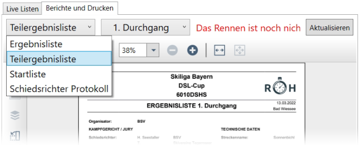

# Berichte & Drucken

## Berichte anzeigen

Race Horology zeigt auf der rechten Hälfte unter dem Tab "Berichte und Drucken" der Anwendung die Vorschau der Listen. Der Listentyp und der gewünschte Durchgang kann oben links ausgewählt werden. Zur Verfügung stehen:

-	Ergebnisliste

- Teilergebnisliste 

- Startliste

-	Schiedsrichter Protokoll

Der Bericht kann aktualisiert werden, wenn sich Änderungen ergeben haben. 

## Berichte exportieren

Durch den Klick auf **Speichern (PDF)**{.btn .btn-secondary} lässt sich der Bericht als PDF-Datei exportieren. 

Es öffnet sich ein Fenster zur Wahl des Speicherorts. 

## Berichte drucken

Zusätzlich ist es auch möglich Berichte direkt auf den Drucker auszugeben. Dies ist über **Drucken**{.btn .btn-secondary} möglich.

Es öffnet sich das Druckfenster Ihres Betriebssystems. 