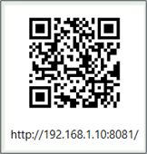

# Externe Anzeige (Sprecheransicht) via Tablet oder Monitor

##	Aufrufen der externen Anzeige

Race Horology hat einen eingebauten Webservice, mit dem es möglich ist das Renngeschehen auf anderen Geräten zu verfolgen, sofern diese über Netzwerk mit dem Computer auf dem Race Horology läuft, verbunden sind.

Man muss dazu die Webadresse im folgenden Format aufrufen:

 *http://\<rechner adresse>:8081*

\<rechner adresse> ist hierbei die IP-Adresse des Rechners, auf dem Race Horology läuft.

Das Programm zeigt rechts oben einen QR Code an. Klickt man auf diesen öffnet sich ein neues Fenster, sodass man mit einem Tablet oder Handy mit Kamera sehr einfach die Webadresse aufrufen kann. 

Man kann dazu je nach Tablet oder Handy z.B. mit der Kamera-App den QR Code erfassen. 

Klickt man auf dem Computer auf den QR Code öffnet sich der Webbrowser mit der korrekten Adresse von selbst.

##	Empfohlene Netzwerk Setups

TODO
