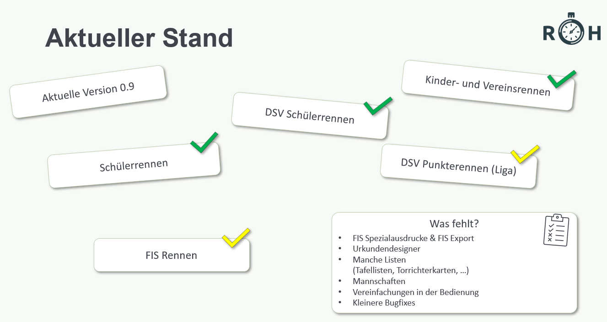

# Funktionsübersicht

- Übersichtlichere Zeitnahme mit mehreren Durchgängen

Die Zeitnahme ist aktuell mit ALGE TdC 8000/8001, ALGE Timy (Serial und USB) sowie Alpenhunde möglich.

- Handzeitberechnung (ALG Timmy sowie Tag Heuer Pocket Pro)

- DSV Punkteberechnung

- Live Timing

- Externe Anzeige für den Sprecher

- Transparente Rennkonfiguration

- Einfacher Berichtedruck inklusive Schiedsrichter-Report

## Fehlende Funktionen

Nicht alle benötigten Funktionen sind bereits (komplett) eingebaut. So z. B. die Mannschaftswertungen. Mit der Zeit werden diese Funktionen nachgereicht. 

Für diese Funktionen ist es weiterhin möglich die Datei im Programm "DSV Alpin" zu öffnen und dort zu bearbeiten. 