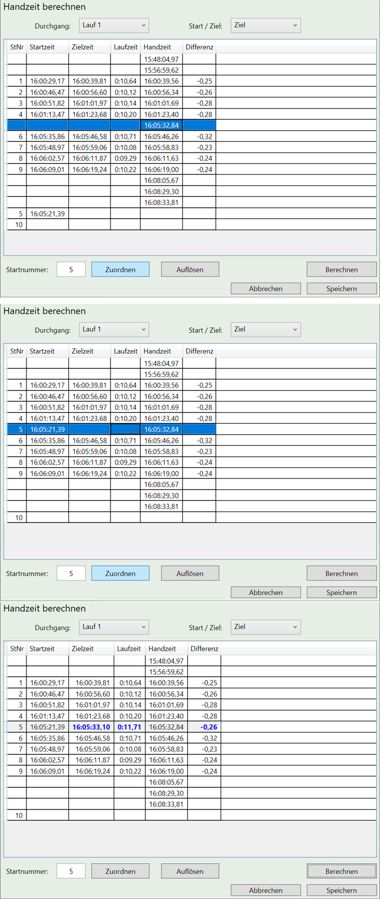

# Renndurchführung

##	Handzeit- / Ersatzzeitberechnung

Race Horology unterstützt die Berechnung einer Ersatzzeit nach der IWO, Regel 611.3.2.1.

In die Handzeitberechnung gelangt man über das Menü **Werkzeuge** und die Funktion **Handzeit berechnen**.

**Hinweis:** Für die Handzeitberechnung ist ein anderer COM-Port (Serielles Interface) als die normale Zeitnahme nötig!

 
###	Handzeit laden

Um die Handzeit zu laden, gehen Sie wie folgt vor:

-	Stellen Sie sicher, dass der korrekte Lauf ausgewählt ist.

- Stellen Sie sicher, dass die richtige Spalte (Start oder Ziel) ausgewählt ist.

- Wählen sie das entsprechende Gerät (ALGE Timy, Tag Heuer oder aus Datei laden) aus.

-	Wählen sie den richtigen **COM-Port** aus. (nicht bei Datei)

-	Starten sie den Ladevorgang mit **Laden**.

- Sie können diesen Vorgang mehrmals wiederholen - die neuen Zeiten werden dann zu bereits vorhandenen Zeiten zur Tabelle hinzugefügt.

###	Handzeit berechnen

Um eine Handzeit zu berechnen, gehen Sie wie folgt vor:

-	Stellen Sie sicher, dass die Handzeiten geladen wurden.

-	Markieren Sie die Handzeit, die verwendet werden soll. Normalerweise ist hier noch keine Startnummer zugewiesen.

-	Weisen Sie der markierten Handzeit die korrekte Startnummer zu indem Sie:

o	Die Handzeit markieren

o	Die korrekte Startnummer eintragen

o	Auf **Zuordnen** drücken.

Die Startnummer und die (eventuell anderen) gemessenen Zeiten werden in einer Zeile angezeigt. Die Differenz ist typischerweise leer (unter der Annahme, dass die A-Zeit fehlt).

-	Berechnen Sie die Handzeit indem Sie:

o	Die zu berechnende Zeit markieren.

o	Auf **Berechnen** klicken.

Mit dem Berechnen wird automatisch ein PDF erzeugt, dass die Zeiten, die zur Berechnung genutzt wurden, enthält.

-	Sie können jetzt weitere Handzeiten berechnen, machen Sie dazu einfach weitere Zuweisungen bzw. Berechnungen.

-	Um die berechneten Handzeiten zu übernehmen, drücken Sie **Speichern**.

### Handzeiten löschen

Es ist möglich bereits geladene Zeiten zu löschen.

- Klicken Sie auf **Handzeiten löschen**

**Achtung:** Es werden *alle* Zeiten gelöscht
