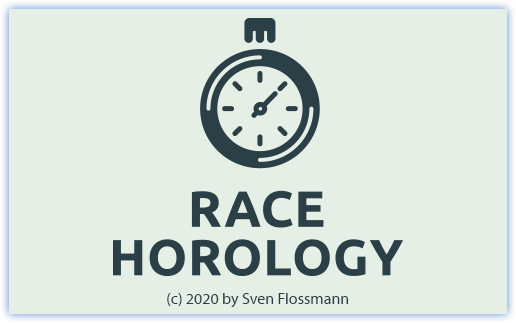

# Dokumentation 

Race Horology ist ein Zeitnahme- und Auswerteprogramm für Rennsportarten (aktuell vorwiegend für Alpine Skiformen) - kompatibel mit "DSV Alpin"

Race Horology befindet sich noch in der Entwicklungsphase. Daher ist der aktuelle Funktionsumfang noch nicht vollständig und man kann im Vergleich zu DSVAlpin bzw. DSVAlpinX an Grenzen kommen. Um diese Grenzen zu überwinden, ist Race Horology kompatibel mit DSVAlpin bzw. DSVAlpinX. Einem wechelseitigen (aber nicht parallelen) Betrieb, steht somit nichts im Wege.

Nutze die Navigation links, um zu den verfügbaren Hilfethemen zu gelangen.
