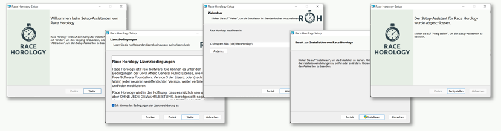

# Installation

Die letzte stabile Version kann über die [Downloadseite](https://race-horology.com/download2/) heruntergeladen werden. 

Tester oder Experiementierfreudige finden die Beta-Versionen direkt auf [GitHub](https://github.com/RaceHorology/RaceHorology/releases).

**Vorsicht:**{.badge .badge-danger .text-uppercase} Beta-Versionen können zwar neue Features, aber auch Bugs enthalten, da diese Versionen nicht ausgiebig getestet wurden. {.alert .alert-warning}

##	Anforderungen

- Unterstützte Betriebssysteme: Windows 10, Windows 11
- Freier Speicherplatz: 500 MB
- Für Livetiming oder Download von Punktelisten: Netzwerkkarte (Funk oder Kabelgebunden) mit Internetverbindung. 
- Für Externe Anzeige: Netzwerkkarte (Funk oder Kabelgebunden) mit lokalem Netzwerk.
- Administratorberechtigung (nur für die Installation)

## Auf dem Computer installieren

Nach dem Download muss die Datei ausgeführt werden (Doppelklick). 

Der Installationsassistent kann immer mit "Weiter" oder "Installieren" fortgeführt werden. Die Lizenz muss dabei akzeptiert werden. Am Schluss wird die Installation mit "Fertig stellen" abgeschlossen. 

Das Programm ist danach über das Startmenü aufrufbar. 

[ Video zur Installation](videos/installieren.html){.fab .fa-youtube}

## Programm aktualisieren (Update)

Über den Menüpunkt *Hilfe* -> *Suche nach Updates* lässt sich das Programm sehr einfach aktualisieren. Sollte ein Update verfügbar sein wird ein Fenster mit weiteren Infos angezeigt und das Update lässt sich starten. Sollte kein Update verfügbar sein, erscheint eine einfache Meldung darüber.

Alternativ kann die Installationsdatei erneut heruntergeladen und installiert werden (siehe oben). 

Persönliche Änderungen und Einstellungen (z.B. Templates) werden bei einem Update in der Regel nicht überschrieben (Außnahmen hierzu werden in der [Änderungshistorie](changelog.html) bekanntgegeben).
