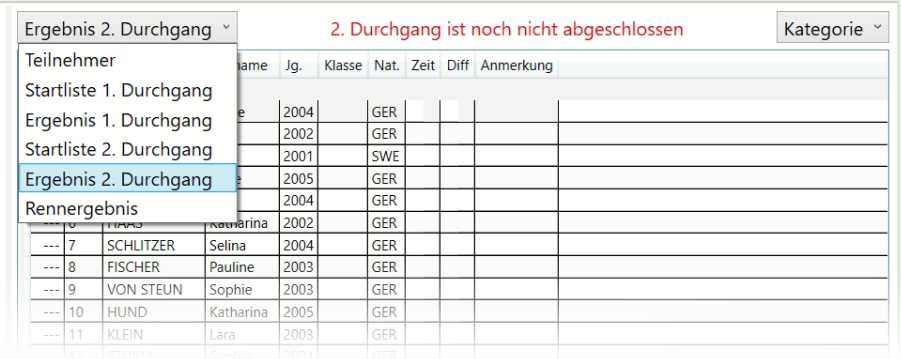

# Listen

## Listen anzeigen

Race Horology zeigt auf der rechten Hälfte der Anwendung die aktuellen Start- oder Ergebnislisten. Den Listentyp kann oben links ausgewählt werden. Zur Verfügung stehen:

-	Teilnehmer

- Startliste 1. Durchgang

-	Ergebnis 1. Durchgang

- Startliste und Ergebnis weiterer Durchgänge (wenn vorhanden)

-	Rennergebnis

Die Gruppierung kann direkt daneben ausgewählt werden. Standardmäßig werden die Listen entsprechend der [Rennkonfiguration](../wettbewerb_rennen) gruppiert. 

## Angezeigte Spalte bearbeiten

Es ist möglich durch einen \<rechtsklick> auf die Spaltenüberschriften zu bestimmen, welche Spalten angezeigt werden sollen. Ebenso lassen sich die Spalten über Drag & Drop verschieben. Die Ansicht wird auf dem Computer gespeichert. 

## Listen drucken

Die gerade aktuell sichtbare Liste kann mittels Drucken in ein PDF-Dokument geschrieben werden. Es wird automatisch ein passender Dateiname vorgeschlagen.
