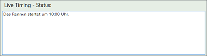

# Renndurchführung

##	Live Timing 

Race Horology unterstützt verschiedene Live Timing Plattformen um das Renngeschehen für die Zuschauer sofort sichtbar zu machen.

###	rennmeldung.de

Um das Livetiming von https://rennmeldung.de zu nutzen gehen Sie wie folgt vor:

-	Geben Sie folgende Daten an: Bewerbsnummer, Login und Passworts.
-	Drücken Sie „Login“.
-	War der Login erfolgreich füllt sich die nachfolgende Combobox mit den verfügbaren Ver-anstaltungen. 
-	Wählen Sie die korrekte Veranstaltung aus.
-	Drücken Sie „Start“.

Jede Änderung, die ab sofort passiert, wird unmittelbar an rennmeldung.de übertragen und ist somit für die renninteressierten Zuschauer sofort sichtbar.

Weiterhin ist es möglich einen Status bzw. Kommentar für die Zuschauer zu hinterlassen. Geben Sie diesen in dem unteren Feld „Live Timing – Status“ ein. Der Text wird automatisch übertragen.

###	FIS Live Timing

**Anmerkung:** FIS Live Timing wird derzeit noch nicht unterstützt – dies kommt in einer der nächsten Versionen (voraussichtlich noch für die Saison 2020/2021).
