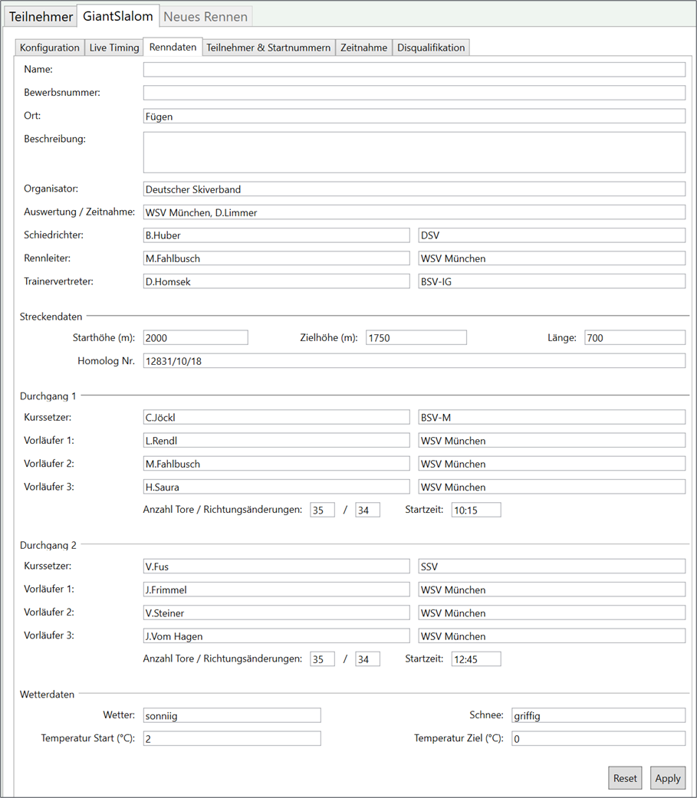

# Renndaten (Listenkopf)

Die Renndaten bestimmen im Wesentlichen die Angaben auf dem Listenkopf auf den erstellten Listen.

## Renndaten importieren

Durck klick auf **Importieren aus anderem Rennen** ist es möglich, die Renndaten aus einem anderen Rennen zu übernehmen, ohne diese erneut manuell zu erfassen. Dies ist z.B. sinnvoll wenn unterschiedliche Rennen am selben Tag stattfinden.