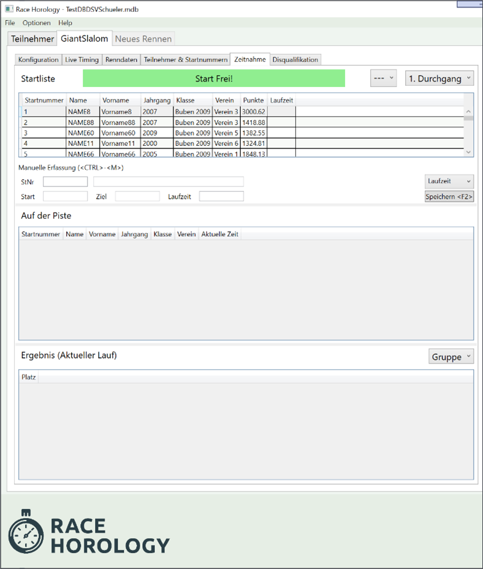
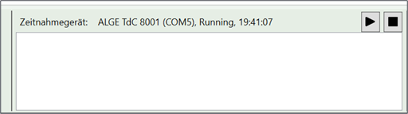

# Renndurchführung

Die Renndurchführung wird primär über die beiden Tabs Zeitnahme und Ausscheidungen durchgeführt.

##	Zeitnahme

Die Zeitnahme erfolgt auf dem Tab *Zeitnahme*.

Als erstes wählt man den aktuellen Durchgang über die Combobox oben rechts.

Der Zeitnahmebereich zeigt drei Listen an: 

-	Im oberen Bereich befindet sich die nächsten Starter, 
-	im mittleren Bereich die Rennläufer die gerade auf der Strecke sind und 
-	im unteren Bereich ist das aktuelle Klassement ersichtlich. 

###	Online Zeitnahme

Um die Zeiten direkt aus dem Zeitnahmegerät während des Rennens zu übernehmen muss man Online Gehen. Das Online Gehen erfolgt über  **Verbinden**{.btn .btn-secondary} im Zeitnahmebereich in der Statuszeile des Programms. 

Wenn man online ist, ist es nicht möglich den aktuellen Durchgang zu wechseln. Um den Durchgang zu wechseln, gehen Sie Offline, wechseln Sie den Durchgang und gehen danach wieder Online. {.alert .alert-success}

Das verwendete Zeitnahmegerät und der verwendete COM Port kann im Menü Optionen eingestellt werden. {.alert .alert-success}

###	Zeitnahme Hilfsfunktionen

Es gibt folgende Zeitnahme Hilfsfunktionen. Entsprechende Zeit-Einstellungen können im Menü Optionen vorgenommen werden.

•	**Automatisch nicht im Ziel**

Wenn ein Läufer nach einer bestimmten Zeit nicht im Ziel ist, wird dieser automatisch als „nicht im Ziel“ (NiZ) gewertet.

•	**Automatisch nicht im Start**

Wenn eine bestimmte Anzahl Starter nach einem nicht gestarteten Läufer gestartet sind, wird der nicht gestartete Läufer automatisch als "nicht am Start" (NaS) gewertet. 

Standardmäßig ist diese Option auf 9999 Läufer gesetzt, um bei Nachmeldungen "nicht am Start" für den Läufer nicht zu setzen. Dieser Wert kann im Menü "Optionen" geändert werden. {.alert .alert-success}

•	**„Start Frei! – Signal“**
Das „Start Frei! – Signal“ erscheint nach einer einstellbaren Zeit, nachdem ein Läufer gestartet ist. Hierbei ertönt auch ein Signalton. 

###	Zeitnahme Testfunktionen

Es existieren folgende Tastenkürzel auf dem Zeitnahme Tab, um mit dem Programm zu experimentieren, ohne ein Zeitnahmegerät zu benutzen.

| Tastaturkürzel | Funktion |
| - | - |
| \<STRG> - <1> | Aktuelle Computerzeit als Startzeit verwenden |
| \<STRG> - <2> | Aktuelle Computerzeit als Zielzeit verwenden |
| \<STRG> - <9> | Startzeit löschen |
| \<STRG> - <0> | Zielzeit löschen |

{.table .table-bordered .table-striped}

### Manuelle Zeiterfassung

Neben der Online Zeiterfassung kann man die Zeiten auch manuell erfassen. Dies kann zum Beispiel erforderlich sein, wenn die Übertragung zum Zeitnahmegerät nicht einwandfrei funktioniert oder eine Zeit manuell korrigiert werden muss oder man nicht Online war.

Die Zeit kann entweder als Differenzzeit (also Start- und Zieltageszeit) oder Absolutzeit (also der eigentlichen Laufzeit) angegeben werden. Das Wechseln des Eingabemodus erfolgt mit der Combobox.

Damit die eingegebenen Zeiten übernommen werden, muss mit **Speichern**{.btn .btn-secondary} bestätigt, oder die Taste *\<F2>* gedrückt werden.{.alert .alert-success}

##	Disqualifikation & Ausscheidungen

Disqualifikationen und Ausscheidungen können hier verwaltet werden. Der Ausscheidungsbereich besteht aus zwei Bereichen: dem Ausscheidungsbereich und dem aktuellen Laufergebnisbereich ähnlich dem Zeitnahme-Tab.

Im Ausscheidungsbereich lassen sich die Teilnehmer nachfolgenden Kriterien filtern:

•	**Ohne Zeit**

Hier erscheinen alle Teilnehmer, bei denen keine gültige Zeit existiert. Üblicherweise ist der Läufer in diesem Fall entweder nicht am Start oder nicht im Ziel gewesen.

•	**Ausgeschiedene**

Hier erscheinen alle Teilnehmer, bei denen bereits eine Ausscheidung vermerkt worden ist 

•	**Keine Daten**

Hier erscheinen Teilnehmer, die weder eine Zeit noch eine Ausscheidung vermerkt haben. Ein Durchgang ist üblicherweise dann erfolgreich abgeschlossen / erfasst, wenn diese Liste leer ist.

•	**Alle**

Alle Teilnehmer erscheinen in der Liste.

Um eine Ausscheidung zu editieren, gehen Sie wie folgt vor:

•	**Startnummer eingeben**

Die Startnummer kann durch Auswahl des Teilnehmers in der Liste festgelegt werden oder durch direkte Eingabe der Startnummer in das Feld „St.Nr“. Mit dem Tastaturkürzel \<STRG> - \<M> kann sofort die Startnummer eingegeben werden.

Nach Eingabe der Startnummer erscheint der Name in dem Feld daneben, sowie eine vorhandene Ausscheidung wird angezeigt.

•	**Ausscheidungstyp auswählen**

Durch \<TAB> kann man in das nächste Feld (Ausscheidungsgrund) springen. Benutzen Sie die Cursor Hoch- und Runtertasten, um den Grund auszuwählen.
Benutzen Sie alternativ die Maus.

•	**Anmerkung eingeben**

Springen Sie mit \<TAB> zum Anmerkungsfeld und geben sie eine Anmerkung ein (z.B. „Tor 8, vorbeigefahren“).

•	**Ausscheidung speichern**

Speichern sie die Ausscheidung mit \<F2> oder mit **Speichern**{.btn .btn-secondary}.

**Achtung:**{.badge .badge-danger .text-uppercase} Stellen Sie sicher, dass Sie den richtigen Durchgang ausgewählt haben. Per Default ist immer der Durchgang der aktuellen Zeitnahme eingestellt. {.alert .alert-warning}

Man kann direkt während der Zeitnahme auch gleich Ausscheidungen eingeben. Der Sprecher sieht dies dann sofort. {.alert .alert-success}

Man kann auch für mehrere Teilnehmer gleichzeitig eine Ausscheidung vermerken. Benutzen Sie dazu die Mehrfachauswahl in der Liste: Wählen Sie die entsprechenden Teilnehmer bei gleichzeitigem Drücken der \<SHIFT> bzw. \<STRG> Taste aus. {.alert .alert-success}
