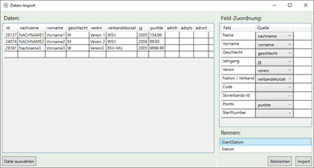
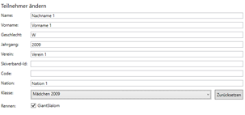

# Teilnehmer

Race Horology unterscheidet zwischen Teilnehmer für einen Wettbewerb und Teilnehmern für ein Rennen. Grundsätzlich muss ein Teilnehmer eines Rennens auch ein Teilnehmer des Wettbewerbes sein. Weiterhin werden die Teilnehmer einer Klasse bzw. einer Gruppe zugeordnet. Diese sollten angelegt werden, bevor die Teilnehmer hinzugefügt werden. Es ist aber auch möglich die Klassen später über den Button **Alle Klassen neu zuweisen** noch zu aktualisieren.

##	Teilnehmer manuell hinzufügen, ändern und löschen

Teilnehmer können in der Tabelle **Teilnehmer & Globale Konfiguration** und Subtabelle **Teilnehmer** editiert werden. Teilnehmerdaten können sowohl direkt in der Tabelle (auf ein Feld Doppelklicken, um den Editiermodus zu aktivieren) als auch in der daneben befindlichen Detailansicht editiert werden.

Um einen neuen Teilnehmer hinzuzufügen, drücken Sie **Teilnehmer hinzufügen**. Der Button **Teilnehmer löschen** löscht alle markierten Teilnehmer nach einer Sicherheitsabfrage. 

**Achtung:** Eventuell vorhandene Zeitdaten werden ebenso gelöscht.

Es ist auch möglich mehrere Teilnehmer gleichzeitig zu ändern. Dies kann hilfreich sein, um z.B. Vereinsnamen oder Nationen zu ändern sowie mehrere Teilnehmer zu einem Rennen hinzuzufügen. Gehen Sie hierzu wie folgt vor:

-	Selektieren Sie die zu bearbeitenden Teilnehmer in der Tabelle (<Shift> oder <Strg> beim Auswählen halten).

-	Verändern Sie die Felder in der Detailansicht. Die Änderungen werden bei allen ausgewählten Teilnehmern sichtbar, sobald der Cursor das Feld verlassen hat (sie also irgendwo anders hingedrückt haben).

##	Teilnehmer einem Rennen zuweisen

Die Teilnehmer können einem oder mehreren Rennen zugewiesen sein. Man kann die Rennteilnahme eines Teilnehmers auf drei Arten beeinflussen bzw. verändern:

+ 	Häkchen in der Tabelle Teilnehmerdaten setzen oder entfernen
+ 	Häkchen in der Detailansicht setzen oder entfernen

**Hinweis:** Durch das Auswählen von mehreren Teilnehmern, kann man mehrere Teilnehmer auf einmal zu einem Rennen hinzufügen oder entfernen. 

+	Bei **Teilnehmer importieren** die entsprechenden Rennen angeben.

##	Teilnehmer importieren

Folgende Importformate werden von Race Horology unterstützt:

-	Textfiles (Komma oder Tab getrennte Datenfelder – CSV, TSV, TXT)
-	Excel (XLS, XLSX)
- DSV Alpin ZIP Import Files

Der Import-Wizard wird gestartet über den Button **Import** im Tab **Teilnehmer**. Nach dem Auswählen der Datei wird der Import-Wizard angezeigt. 

Im linken Bereich befindet sich die Datenvorschau. Sie zeigt die zu importierenden Daten an. 

Im rechten Bereich befindet sich oben die **Datenfeldzuordnung**. Pro Race Horology Datenfeld kann ein Datenimportfeld ausgewählt werden. Stellen Sie hier die korrekte Feldzuordnung sicher.

**Hinweis:** Die Datenfeldzuordnung versucht eine sinnvolle Datenzuordnung auf Basis der Feldbezeichnungen zu erraten.

Im unteren rechten Bereich wird angegeben, zu welchem Rennen die Teilnehmer zugeordnet werden sollen. Aktivieren Sie die Rennen, zu denen die Teilnehmer importiert werden sollen – per Default sind dies alle.

###	Klassen und Gruppen zuweisen

Klassen und Gruppen müssen typischerweise nicht neu zugewiesen werden, da diese durch den Jahrgang festgelegt ist und automatisch zugewiesen werden. Dennoch gibt es folgende Möglichkeiten die Klasse einem Teilnehmer zuzuweisen:

-	Auswahlbox bei Teilnehmer editieren

Mit der Auswahlbox bei Teilnehmer editieren kann die Klasse explizit überschrieben werden.

-	Zurücksetzen bei Teilnehmer editieren

Der Button **Zurücksetzen** setzt die Klasse für den aktuellen Teilnehmer wieder auf Basis des Jahrgangs des Teilnehmers zurück. 

-	Klassen aller Teilnehmer zurücksetzen

Der Button **Klassen neu zuweisen** setzt die Klassen alle Teilnehmer auf Basis des Jahrgangs zurück.

## Automatischer Abgleich mit Punkteliste

Sind Teilnehmer über eine Punkteliste importiert und haben sich Daten geändert, so wird die jeweilige Tabellenzeile orangefarben hinterlegt. Beispiele sind z.b. falscher Name, Vorname oder geänderte Punkte die noch nicht aktualisiert wurden.
