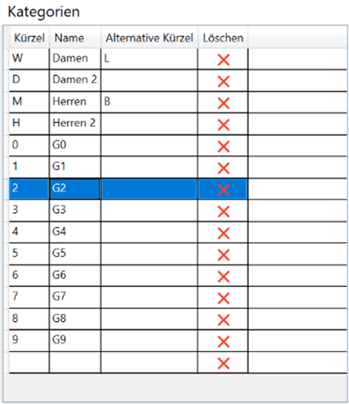

# Klassen, Gruppen und Kategorien

## Erstellen und Editieren von Klassen und Gruppen

Das Erstellen und Editieren von Gruppen findet man in der Tabelle **Teilnehmerdaten** und der Sub-Tabelle **Klassen und Gruppen**. 

Um eine neue Gruppe oder Klasse anzulegen, muss man in der entsprechenden leeren Zeile die Daten eingeben. Um eine Gruppe oder Klasse zu löschen, auf das entsprechende „X“ klicken.

Die Reihenfolge in dieser Ansicht wird so auf allen Berichten und Listen übernommen. Mittels Drag and Drop können die Einträge verschoben werden, um die Reihenfolge innerhalb der Gruppen und Klassen zu ändern.

Beim Jahrgang kann auch das Alter angegeben werden. Das Alter wird in die entsprechende Jahreszahl umgewandelt. Annahme hierfür ist, dass die Saison immer am 1. Oktober eines Jahres anfängt. {.alert .alert-success}

Die Änderungen werden erst nach dem Drücken von **Speichern**{.btn .btn-secondary} übernommen. {.alert .alert-success}

Über **Jahrgang + 1**{.btn .btn-secondary} bzw. **Jahrgang - 1**{.btn .btn-secondary} ist es möglich die Jährgänge aller Klassen zu erhöhen oder zu verringern - dies ist sinnvoll wenn Klassen aus einem früheren Jahr importiert werden. Zusätzlich wird auch, der Text der Klasse mit geändert (sofern der Text einer Klasse den Jahrgang enthält).

##	Erstellen und Editieren von Kategorien (Geschlecht)

Kategorien werden wie Klassen und Gruppen editiert. Standardmäßig sind bereits gebräuchliche Kategorien definiert. Sie müssen daher deutlich weniger angepasst werden.

Bei den Kategorien gibt es folgende Datenfelder:

-	Kürzel

Das Kürzel ist die Kurzform der Kategorie und wird beim Datenimport bzw. -export benutzt. Üblicherweise wird das Geschlecht eines Teilnehmers durch das Kürzel ausgedrückt. Groß-kleinschreibung ist hierbei egal.

-	Name

Die Langform der Kategorie.

-	Alternative Kürzel

Es gibt Fälle, in denen die Importdaten nicht immer die gewünschten Kürzel enthalten, z.B. könnten Importdaten anstelle von D für Damen ein L für Lady enthalten. Mit dem **Alternativen Kürzel** ist es in diesem Beispiel möglich, die Lady-Einträge dennoch den Damen zuzuordnen.

Um mehrere Alternative Kürzel anzugeben können diese einfach nacheinander stehen. Beispiel: „DL“
Beim Export hat das Alternative Kürzel keine Auswirkung. {.alert .alert-success}

##	Klassen und Gruppen importieren

Klassen und Gruppen können von anderen Bewerbsdateien importiert werden. Hierbei können entweder alle Klassen und Gruppen importiert und die bestehenden Klassen und Gruppen ersetzt werden, oder die neu importierten Klassen und Gruppen werden zu bereits existierenden Klassen und Gruppen hinzugefügt.

Drücken Sie dazu entweder **Importieren und Ersetzen**{.btn .btn-secondary} oder **Importieren und Hinzufügen**{.btn .btn-secondary} und wählen Sie die Bewerbsdatei aus, deren Klassen und Gruppen importiert bzw. hinzugefügt werden sollen.

Die Änderungen werden erst nach dem Drücken von **Speichern**{.btn .btn-secondary} übernommen. {.alert .alert-success}
