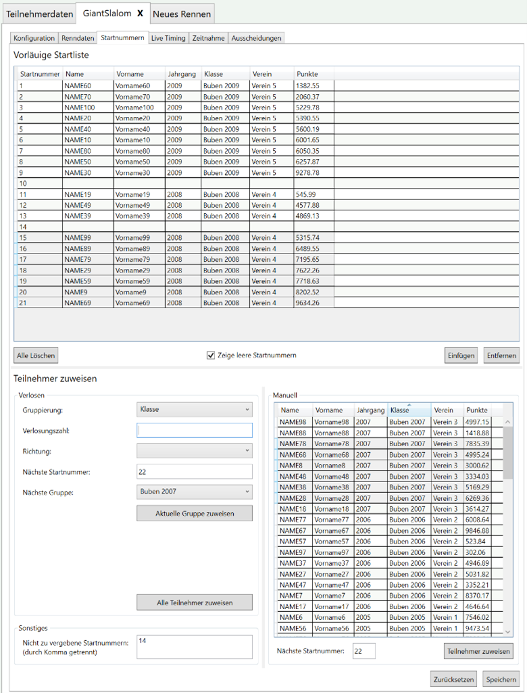

#	Startnummernvergabe

Die Startnummern werden pro Rennen den Teilnehmern zugewiesen. Dies erfolgt über die entsprechende **Renntabelle** in der Subtabelle **Startnummern**. Die Startnummern können manuell oder automatisch per Zufall (Verlosung) vergeben werden.

**Hinweis:** Die Startnummern werden im Programm erst dann übernommen, wenn **Speichern**{.btn .btn-secondary} gedrückt wurde. Mit **Zurücksetzen**{.btn .btn-secondary} wird die Startnummernvergabe wieder zum letzten gespeicherten Stand zurückgesetzt.

**Hinweis:** Sollte es vorkommen, dass ein Startnummertrikot nicht genutzt werden kann, ist es möglich in den Optionen im Feld **Nicht zu vergebene Startnummern** die Startnummern durch Komma getrennt einzutragen, deren Startnummern nicht vergeben werden sollen.

## Vorläufige Startliste

Der obere Bereich zeigt die vorläufige Startliste. Sie enthält pro Zeile die Startnummer und die zu-gehörigen Teilnehmerdaten. 

Es kann vorkommen, dass manche Startnummern nicht vergeben sind. Mit dem Häkchen **Zeige leere Startnummern** können diese in der vorläufigen Startliste sichtbar gemacht werden. Dies ist hilfreich, um leere Startplätze bei einer manuellen Zuweisung zu identifizieren.

Mit **Einfügen**{.btn .btn-secondary} kann eine Startnummer vor die markierte Zeile eingefügt werden. Alle Teilnehmer danach werden um eine Startnummer nach hinten verschoben.

Mit **Entfernen**{.btn .btn-secondary} kann eine oder mehrere markierte Zeilen entfernt werden. Alle Teilnehmer nach der entfernten Zeile werden entsprechend nach vorne verschoben.

**Alle Löschen**{.btn .btn-secondary} entfernt alle bisherigen Startnummernzuweisungen.

##	Startnummern manuell zuweisen

Teilnehmer können manuell einer Startnummer zugewiesen werden. Gehen Sie hierzu wie folgt vor:

-	„**Startnummer**“ angeben

**Hinweis:** Wenn nichts weiter eingegeben wird, zeigt dieses Feld automatisch auf die höchste vergebene Startnummer plus 1. 

-	Einen oder mehrere Teilnehmer auswählen.

Hinweis: Die Auswählreihenfolge bleibt erhalten und wird beim Zuteilen der Startnummer beachtet. 
-	Auf **Teilnehmer zuweisen**{.btn .btn-secondary} klicken. 

Die ausgewählten Teilnehmer werden entsprechend der Auswahlreihenfolge aufeinanderfolgende Startnummern beginnend mit der angegebenen **Startnummer** zugewiesen.

**Achtung:** Wird eine bereits zugewiesene Startnummer angegeben, so wird diese Belegung überschrieben. Der Teilnehmer, der vorher dies Startnummer hatte, ist in dem Fall in der noch zuzuweisenden Teilnehmerliste zu finden.

##	Startnummern zufällig vergeben (Verlosung)

Typischerweise wird die Startreihenfolge verlost – per Zufall vergeben. Dies erfolgt meist entsprechend einer Gruppierung.

Um Startnummern zufällig zu vergeben, gehen Sie wie folgt vor:

-	Wählen Sie die Gruppierung. 

Dies kann nach Klasse, Gruppe, Geschlecht oder aber auch gar keiner Gruppierung sein.

-	Geben Sie die Verlosungszahl an (sofern gewünscht).

Die Verlosungszahl gibt an, wieviel Teilnehmer via Zufall verlost werden. Die restlichen Teilnehmer einer Gruppe werden entsprechend der Punkte absteigend oder aufsteigend sortiert zugeteilt. Ist die Verlosungszahl nicht angegeben, so werden alle Teilnehmer verlost.

-	Geben Sie die Sortierrichtung an.

Die Sortierrichtung gibt an ob die Punkte aufsteigend oder absteigend sortiert betrachtet werden.

-	Geben Sie die nächste Startnummer an.

Dies kann verwendet werden um z.B. zwischen Gruppen Platz für Nachmeldungen zu lassen.

-	Starten Sie die Startnummernzuweisung mit 

  -	**Aktuelle Gruppe zuweisen**{.btn .btn-secondary}

Geben Sie hierzu noch die Nächste Gruppe an. Es werden nur die Teilnehmer der aktuellen Gruppe zugewiesen.

oder 

-	**Alle Teilnehmer zuweisen**{.btn .btn-secondary}

Es werden alle restlichen Teilnehmer, Gruppe für Gruppe zugewiesen.

**Hinweis:** Standardmäßig werden die Parameter aus der Rennkonfiguration für die Startliste des 1. Durchgangs übernommen und sollten daher keiner weiteren Einstellung benötigen.
