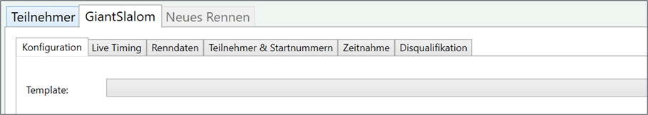

# Rennkonfiguration

Die Rennkonfiguration gibt an, wie ein Rennen ausgewertet werden soll und welche Datenfelder benutzt werden. Beispielparameter einer Rennkonfiguration sind: Anzahl der Durchgänge, Sortierung der Startliste, Gruppierungen für Startliste bzw. die Ergebnisse, verwendete Datenfelder. Auch DSV- oder FIS-spezifische Parameter wie F-Wert, Adder und Minimumzuschlag sind Teil der Rennkonfiguration.
Die Rennkonfiguration befindet sich z.B. im Tab „Konfiguration“ des entsprechenden Rennens.

## Globale und Lokale Konfiguration

Derzeit gibt es sowohl eine *Globale Konfiguration* als auch eine *Lokale Konfiguration*. 

Die Globale Konfiguration gilt für alle Rennen, die in einer Bewerbsdatei angelegt sind (z. B. Slalom) kann aber in einer weiteren Einstellungsseite im Rennen selbst überschrieben werden. Welche Konfiguration gültig ist, kann man anhand eines Symbol (entweder blau oder rot) mit dem Buchstaben **G** oder **L** erkennen. 

Soll in einem Rennen die Globale Konfiguration wieder genutzt werden, so ist dies über den Button **Globale Konfiguration nutzen** möglich. 

**Achtung:**{.badge .badge-danger .text-uppercase} In diesem Fall werden die Einstellungen der Lokalen Konfiguration überschrieben! {.alert .alert-warning}

## Template

Um nicht jedes Mal eine komplette Rennkonfiguration eingeben zu müssen, kann die Rennkonfiguration aus einem Template erstellt werden. Beispieltemplates sind DSV Schüler, Skiverbandsrennen, Vereinsrennen.

Das Template und etwaige danach durchgeführten Änderungen werden erst übernommen, nachdem der Button **Speichern**{.btn .btn-secondary} gedrückt wird. 

## Sektion "Allgemein"

Hier kann die Anzahl der Durchgänge (1 - 6) sowie die Berechnungsmethode angegeben werden. 

Folgende Berechnungsmethoden stehen aktuell zur Verfügung: 

###### Bester Durchgang

Es wird nur die Beste Zeit aus allen Durchgängen gewertet.

###### Summe der besten 2 Durchgänge

Die 2 besten Zeiten aus allen Durchgängen werden gewertet.

###### Summe

Die Zeiten aus allen Durchgängen werden zusammengerechnet.

###### Summe + Punkte nach IWO/DWO

Wie Summe, jedoch wird zusätzlich beim Druck die Punkteberechnung mit ausgegeben. Diese Einstellung ist für DSV Schülerpunkterennen aber auch FIS-Rennen einzustellen.

###### Summe + Punkte nach Tabelle

Wie Summe, jedoch wird zusätzlich beim Druck die Punkteberechnung mit ausgegeben. Die Punkte werden standardmässig nach folgender internen Tabelle berechnet:

| Platz | Punkte |
| ----- | ------ |
| 1     | 15     |
| 2     | 12     |
| 3     | 10     |
| 4     | 8      |
| 5     | 6      |
| 6     | 5      |
| 7     | 4      |
| 8     | 3      |
| 9     | 2      |
| 10    | 1      |

{.table .table-bordered .table-striped}

Es ist auch möglich eigene Punkte je Platz zu definieren. Hierzu ist eine Datei *"PointsTable.txt"* im selben Ordner wie die Bewerbsdatei anzulegen. In die Datei sind nur die Punkte nach Platz einzutragen, beginnend mit Platz 1 in der ersten Zeile. Dezimalzahlen werden ebenfalls unterstützt (mit Punkt als Trennzeichen). 

Wir haben eine [Beispieldatei](../../assets/downloads/PointsTable.txt) bereitgestellt.

## Durchgang 1 

Die Gruppierung ist vor allem für die Startnummernvergabe ausschlaggebend. Folgende Gruppierungen sind vorhanden:

###### ---

Es findet keine Gruppierung der Teilnehmer statt. 

###### Klasse

Die Teilnehmer werden nach Klasse gruppiert (z.B.: U10 weiblich).

Klassen müssen hierfür über "Klassen und Gruppen" erstellt sein. {.alert .alert-success}

###### Gruppe

Die Teilnehmer werden nach Gruppe gruppiert (z.B.: MannschaftA).

Gruppen müssen hierfür über "Klassen und Gruppen" erstellt sein. {.alert .alert-success}

###### Kategorie

Die Teilnehmer werden nach Kategorie gruppiert (z.B.: Damen).

Kategorien müssen hierfür über "Klassen und Gruppen" erstellt sein.  {.alert .alert-success}

### Startsortierung

Hier kann eingestellt werden, wie die Startliste aufgebaut wird. Entweder nach *Startnummer (aufsteigend)* oder nach Punkten (z.B. bei FIS-Rennen).

## Durchgang 2 (wenn vorhanden und weitere Durchgänge)

Die Gruppierung funktioniert hier gleich wie für den Durchgang 1. Für die Startsortierung gibt es durch die vorhandenen Zeiten nun weitere zusätzliche Möglichkeiten:

###### Startnummer (absteigend)

Dies ist sinnvoll, wenn die Startreihenfolge komplett umgekehrt werden soll. 

###### Vorheriger Lauf nach Zeit

Dies ist die Standardeinstellung für DSV- und FIS-Rennen. Zusätzlich kann man je nach Reglement noch weitere BIBO Einstelllungen wählen:

- nicht gedreht

- ersten 15 gedreht

- ersten 30 gedreht

- alle gedreht

Diese Einstellungen können durch den Zusatz *(inkl. ohne Ergebnis)* auch die ausgeschiedenen Teilnehmer aus den vorherigen Läufen enthalten.

## Berechnung

Für DSV-Punkterennen oder FIS-Rennen ist es erforderlich die Parameter für die Punkteberechnung einzugeben. Diese Daten werden in der Regel für jede Saison festgelegt oder im Reglement vorgeschrieben. 

Folgende Daten können eingegeben werden: 

- F-Wert

- Kategorie-Adder

- Korrekturwert (Z-Wert)

- Minimumzuschlag

- Maximalwert

**Achtung:**{.badge .badge-danger .text-uppercase} Sollte der Maximalwert auf 0 sein, so wird auch in der Punkteberechnung überall 0 verwendet. Es sollte deshalb in der Regel immer ein Maximalwert eingegeben werden (z. B. 250 bei DSV Rennen) {.alert .alert-warning}

## Rennkonfiguration übernehmen

Die Rennkonfiguration wird erst übernommen, wenn auf **Speichern**{.btn .btn-secondary} gedrückt wird.

Die DSVAlpin-Rennkonfiguration wird derzeit nicht aus dem DSVAlpin Programm übernommen. Kontrollieren sie die Parameter, wenn die Bewerbsdatei aus DSVAlpin übernommen wird. {.alert .alert-success}

## Zurücksetzen

Über **Zurücksetzen**{.btn .btn-secondary} kann man die ungesicherten Änderungen wieder rückgängig machen. Es werden dann die ursprünglichen Werte wieder angezeigt. 